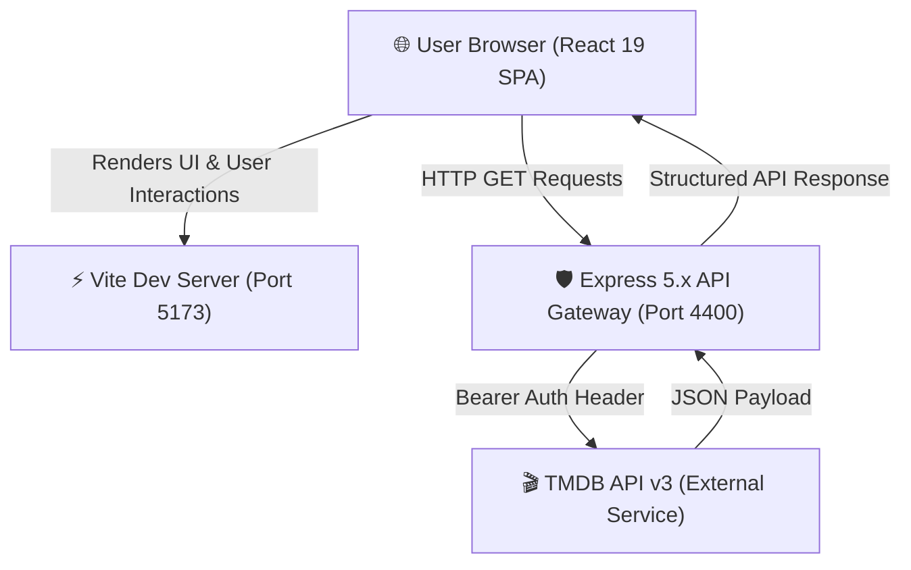
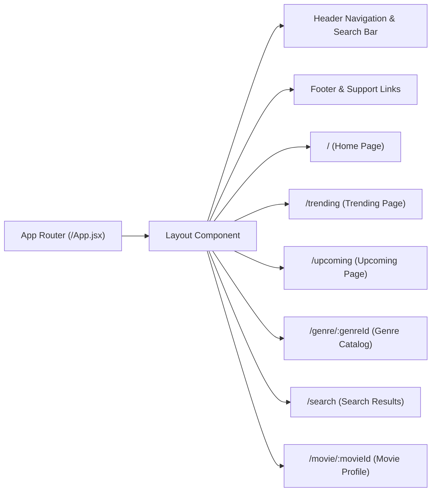

# 🎬 MovieForecasts (MVF)

> **Cinematic Intelligence Engine & Box Office Analytics**  
> Predict the pulse of cinema with real-time box office forecasting, trending movie discovery, upcoming release calendars, genre analytics, and deep-dive movie intelligence.


---

## 🌟 Executive Overview

**MovieForecasts (MVF)** is a full-stack, high-performance web application designed for film enthusiasts, box office trackers, and industry analysts. Powered by a decoupled Node.js/Express API Gateway and a modern React 19 frontend, MVF delivers seamless real-time access to TMDB data, proprietary Hype Scores, trailer spotlight modals, and granular movie metadata.

---

## ✨ Key Features

- 🍿 **Cinematic Hero Spotlight**: Features real-time **Hype Scores** (e.g. 92%), ratings, synopsis, and interactive video trailer playouts.
- 🔥 **Trends Now Engine**: Live trending discovery feed with dual view toggles (**Popular** vs. **Recently Added**).
- 🏷️ **Dynamic Genre Filtering**: Seamless category switching (Sci-Fi, Action, Thriller, Drama, Animation, and more) with real-time query updates.
- 🗓️ **Upcoming Drops Tracker**: Calendar releases with "Soon" status badges and release date previews.
- 🔍 **Live Search Catalog**: Instant search across titles, keywords, and box office forecasts.
- 🎬 **Deep-Dive Movie Details**:
  - High-definition backdrops & poster art.
  - Detailed runtime, release year, tagline, and director highlights.
  - Interactive top cast carousel with character roles.
  - Embedded YouTube video trailer modal.
  - Smart recommendations for similar movies.
- 💎 **Modern Dark Design System**: Built with Tailwind CSS v4, custom glassmorphism components (`.glass-card`), card lift interactions (`.card-hover-lift`), and Material Symbols typography.

---

## 🏗️ System Architecture

MVF uses a decoupled client-server architecture to keep API credentials secure and ensure efficient data processing.

### High-Level Full-Stack Architecture



### Route & Component Sitemap



---

## 🛠️ Technology Stack

| Layer | Technology | Key Details |
| :--- | :--- | :--- |
| **Frontend Framework** | React 19 (`react`, `react-dom`) | Vite 8 build tool with Fast Refresh |
| **Styling** | Tailwind CSS v4 (`@tailwindcss/vite`) | Custom `@theme` color tokens, glassmorphism, fluid animations |
| **Routing** | React Router v7 (`react-router-dom`) | Declarative SPA route management |
| **UI Components** | Swiper 14, Material Symbols | Touch-friendly cast carousels & icons |
| **Backend Runtime** | Node.js (CommonJS) | Express 5.x REST framework |
| **Middleware** | CORS, Cookie Parser, Dotenv | Cross-origin resource sharing & env variables |
| **Data Provider** | TMDB REST API v3 | Popularity, discovery, credits, and video feeds |

---

## 📡 Backend API Reference

The Express proxy server runs at `http://localhost:4400` and exposes the following endpoints:

| Endpoint | Method | Description | Query / Route Params |
| :--- | :---: | :--- | :--- |
| `/trending` | `GET` | Fetches current popular movies feed | None |
| `/upcoming` | `GET` | Fetches upcoming movie drops | None |
| `/genre/:genreId` | `GET` | Discovers movies by TMDB genre ID | `genreId` (e.g. `878` for Sci-Fi) |
| `/search` | `GET` | Searches movies by query string | `query` (e.g. `?query=interstellar`) |
| `/movie/:movieId` | `GET` | Complete movie profile with credits, videos & similar | `movieId` (e.g. `157336`) |

---

## 📁 Repository Structure

```
MVF/
├── README.md                      # Main Project Documentation
├── claude.md                      # Design Guidelines & Prompts
├── things_to_add.md               # Feature Roadmap & Checklist
├── Server/                        # Express API Proxy Backend
│   ├── app.js                     # Express application & route handlers
│   ├── server.js                  # HTTP Server bootstrap (Port 4400)
│   ├── package.json               # Backend dependencies (Express 5, CORS, Dotenv)
│   └── .env                       # API Credentials (API_HEADER_CRED, PORT)
└── Frontend/                      # React 19 + Vite Frontend SPA
    ├── index.html                 # Single Page Application entry point
    ├── vite.config.js             # Vite + Tailwind CSS plugin config
    ├── package.json               # Frontend dependencies (React 19, Tailwind v4, React Router)
    ├── .env                       # Frontend configuration (VITE_BACKEND_URL, VITE_IMG_BASE_PATH)
    ├── public/
    │   ├── favv.png               # Brand Favicon
    │   └── mvf_banner.jpg         # Hero Graphic Banner
    └── src/
        ├── App.jsx                # Router declaration
        ├── main.jsx               # React DOM root mounting
        ├── index.css              # Tailwind CSS theme tokens & custom animations
        ├── components/
        │   ├── layout.jsx         # Global page container
        │   ├── header.jsx         # Sticky header with search input & mobile menu
        │   ├── footer.jsx         # Brand footer with navigation links
        │   └── loadingScreen.jsx  # Pulse loading indicator
        └── pages/
            ├── home.jsx           # Main landing dashboard & hero spotlight
            ├── trending.jsx       # Real-time trending movies grid
            ├── upcoming.jsx       # Upcoming calendar releases
            ├── genre.jsx          # Genre-filtered discovery view
            ├── search.jsx         # Dynamic search results
            └── movieDetail.jsx    # Detailed movie page with cast & trailer modal
```

---

## 🚀 Getting Started & Local Setup

Follow these steps to run MovieForecasts locally on your machine.

### Prerequisites

- **Node.js**: v18.0.0 or higher
- **npm**: v9.0.0 or higher
- **TMDB API Key / Bearer Token**: Free API access token from [The Movie Database (TMDB)](https://www.themoviedb.org/).

---

### 1. Backend Server Setup

1. Open a terminal and navigate to the `Server` directory:
   ```bash
   cd Server
   ```
2. Install dependencies:
   ```bash
   npm install
   ```
3. Create a `.env` file in the `Server/` directory with the following variables:
   ```env
   PORT=4400
   API_HEADER_CRED=your_tmdb_bearer_token_here
   ```
4. Start the Express development server:
   ```bash
   npm run dev
   ```
   *The server will start listening on `http://localhost:4400`.*

---

### 2. Frontend Application Setup

1. Open a new terminal tab and navigate to the `Frontend` directory:
   ```bash
   cd Frontend
   ```
2. Install dependencies:
   ```bash
   npm install
   ```
3. Create a `.env` file in the `Frontend/` directory:
   ```env
   VITE_BACKEND_URL=http://localhost:4400
   VITE_IMG_BASE_PATH=https://image.tmdb.org/t/p/w500
   ```
4. Start the Vite development server:
   ```bash
   npm run dev
   ```
5. Open your browser and navigate to `http://localhost:5173`.

---

## 🎨 Design System Tokens

The application utilizes Tailwind CSS v4 design tokens declared in `src/index.css`:

```css
@theme {
  --color-primary: #e11d48;                  /* Crimson Red Accent */
  --color-surface: #121212;                  /* Deep Dark Background */
  --color-surface-container: #1e1e1e;        /* Dark Card Container */
  --color-surface-container-high: #2a2a2a;   /* Interactive Highlight */
  --color-on-surface: #dae2fd;               /* Primary Text Color */
  --color-on-surface-variant: #a0a0a0;       /* Secondary Text Color */
  --font-sans: "Inter", sans-serif;
}
```

---

## 📄 License

This project is open-source under the ISC License. Box office metadata provided by [TMDB](https://www.themoviedb.org/).
